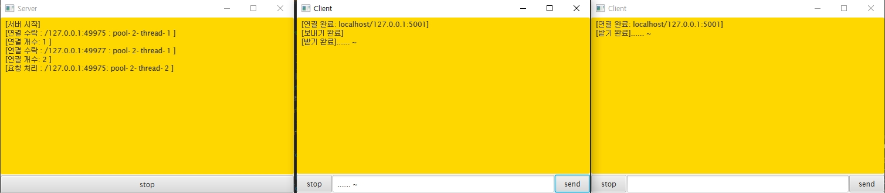

MultiChatting
==============
## java 네트워크 이해
* Link:[네트워크 이해](network.md)

## MultiChatting CheckPoint
* Link:[CheckPoint](checkPoint.md)

***

## 구현 이미지
* 서버 시작

* 클라이언트 접속

* 클라이언트 1 send

* 클라이언트 2 send

* 클라이언트 1 stop

* 서버 stop

