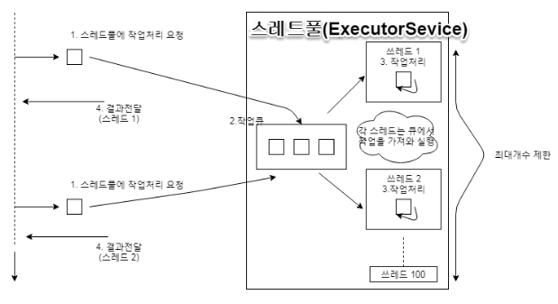

MultiChatting CheckPoint
========================
***
### 스레드 병렬 처리
1. 블로킹 고민
- inputStream 의 read() 메소드는 상대방이 데이터를 보내기 전까지 블로킹 된다.  
 OutputSteam 의 write() 메소드는 데이터를 완전하게 보내기 전까지 블로킹 된다  
 결론적으로 ServerSocket 과 Socket은 동기(블로킹)방식이다.  
 서버와 클라이언트는 지속적으로 연결 수락 기능을 수락해야 하는데, 입출력에서 블로킹되면 이 작업을 수행 할 수 없다. 
 클라이언트1이 입출력하는 동안 클라이언트2가 입출력을 할 수 없다.  
 그래서 accept(), connect(), read(), write()는 **별도의 작업 스레드를 생성해서 병렬적으로 처리** 하는 것이 좋다

 2. 스레드풀
 - 병렬 처리 할 경우, 수천 개, 수만 개의 클라이언트가 동시에 연결할 경우 서버의 성능은 급격하게 저하된다.  
 클라이언트의 폭증으로 인해 **서버의 과도한 스레드 생성을 방지하려면 스레드풀** 을 사용해야 한다.

3. 스레드풀을 이용한 서버 구현 방식
클라이언트가 연결 요청 --> 서버의 스레드풀에서 연결 수락 후 socket 생성 --> 클라이언트가 작업 처리 요청 --> 서버의 스레드풀에서 요청 처리 --> 응답을 클라이언트로 보냄
- 스레드 수 제한 이유 : 갑작스런 클라이언트의 수가 폭증하면 작업 큐의 작업량만 증가 / 스레드 수는 변함 없음 / 서버 성능 저하 
스레드 수 제한 하면 대기 하는 작업량이 많을 경우 개별 클라이언트에게 응답을 늦게 받을 수 있다.
