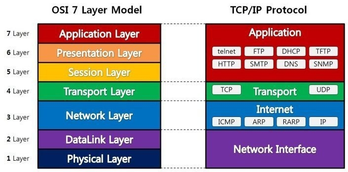
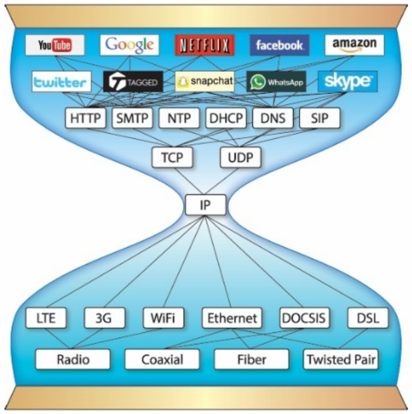

Java Network
============
### 네트워크란?

1. 다른 장치로 데이터를 이동시킬 수 있는 컴퓨터들과 주변 장치들의 집합

2. 노드 : 네트워크에 연결된 모든 장치들

3. 호스트 : 다른 노드에게 하나 이상의 서비스를 제공

4. OSI 계층 : 하나의 컴퓨터에서 다른 컴퓨터로 데이터를 이동시킬 때 복잡한 계층을 통해 전송 되는 레이어 중 대표적인 모델

5. 인터넷 기반의 표준 모델로 사용하는 TCP/IP 계층 모델을 주로 사용

6. 자바에서 얘기하는 네트워크 프로그래밍은 TCP/IP 모델을 사용

***
* OSI 7 계층 단계

* 7 계층 - 응용계층 (Application) :  
사용자에게 보여지는 부분 / 사용자와 직접적으로 상호작용
(크롬, 파이어폭스, 사파리, 오피스 등등)

* 6 계층 - 표현계층 (Presentation) :  
응용프로그램이나 네트워크를 위해 데이터를 표현 하는 곳
(암호화, 복호화 처리)

* 5 계층 - 세션계층 (Session) :  
2대 기기 간의 "대화"가 필요하면 세션을 만드는데 여기서 처리 / 설정, 조율(시스템의 응답 대기 시간), 세션 마지막의 응용프로그램 간의 종료 등의 기능 담당

* 4 계층 - 전송계층 (Transport) :  
최종 시스템 및 호스트 간의 데이터 전송 조율을 담당 / 보낼 데이터의 용량과 속도, 목적지 등을 처리 (TCP- 전송 제어 프로토콜)

* 3 계층 - 네트워크계층 (Network) :  
라우터 기능 위치 / 패킷 전달을 담당  
(보스턴에 있는 컴퓨터가 캘리포니아에 있는 서버에 연결할려고 할 때 그 경로는 수백만 가지이다. 이 계층의 라우터가 이 작업을 효율적으로 처리)

* 2 계층 - 데이터 링크 계층 (Data Link) :  
노드 간 데이터 전송을 제공하며 물리 계층의 오류 수정도 처리/ 2개의 부계층도 존재 < 매체 접근 제어(MAC)계층 , 논리적 연결 제어(LLC)계층 >
(네트워킹 세계에서 대부분의 스위치는 2계층에서 작동)

* 1 계층 - 물리계층 (Physical) :  
시스템의 전기적, 물리적 표현을 나타낸다. (무선 주파수 링크, 케이블 연결, 라우터, 스위치 , 전원 플러그)
***
### 서버와 클라이언트
1. 서버 (server) : 서비스를 제공하는 프로그램

2. 클라이언트 (client) : 서비스를 받는 프로그램

3. 인터넷에서 두 프로그램이 통신하기 위해서는 연결을 요청하는 역할과 연결을 수락하는 역할 필요  
서버는 클라이언트가 요청(request) 하는 내용을 처리해주고, 응답(response)을 클라이언트로 보낸다.

4. 서버 모델 한개에 다수의 클라이언트로 구성되는 것이 보통적인 예  
P2P (peer to peer) 모델 : 두 개의 프로그램이 서버인 동시에 클라이언트 역할을 한다. (1:1채팅 / 파일공유 프로그램)

### IP주소

1. 모든 호스트는 인터넷 주소라 불리는 유일한 32비트 숫자로 구성된 주소 체계를 이용하여 서로를 구분할 수 있다.

2. IP주소는 32비트 숫자를 한번에 모두 표현하는 것이 힘들기 때문에, 8비트씩 끊어서 표현한다. 각 자리는 1바이트로 0~255까지의 범위를 가진다.

3. IP버전4(IPv4) : 32비트 주소 체계

4. IP버전6(IPv6) : 오늘날 IPv4는 포화상태이고, 이를 극복하고자 나온 것 / 128비트의 주소 체계를 관리하고 있다. 16비트씩 8부분으로 나누어 16진수 표시

5. DNS (Domain Name System) : 컴퓨터가 사용하고 있는 IP주소를 도메인 이름으로 바꿔주는 시스템

6. 자신의 IP주소 확인 : cmd 에서 'ipconfig' 치고 IPv4 주소 확인

### 포트와 프로토콜
##### 포트
1. 물리적 포트 : 컴퓨터의 주변기기를 접속하기 위한 포트  
  논리적 포트 : 프로그램에서 사용되는 접속 포트

2. 잘 알려진 포트 (예약된 포트) : 80(HTTP), 21(FTP), 22(SSH), 23(TELNET) 등이 있다.

3. 클라이언트도 서버에서 보낸 정보를 받기 위해 포트 번호가 필요  
서버와 같이 고정적인 포트 번호가 아니라 운영체제가 자동으로 부여하는 동적 포트 번호를 사용

##### 프로토콜
1. 클라이언트와 서버간의 통신 규약

2. 통신규약 : 상호 간의 접속, 전달방식, 통신방식, 주고받을 데이터의 형식, 오류검출 방식, 코드 변환 방식, 전송속도 등을 정의

3. 대표적인 인터넷 표준 프로토콜 TCP , UDP

### 소켓 프로그래밍

1. 소켓을 이용한 통신 프로그래밍

2. 소켓 (Socket) : 프로세스 통신 간에 사용되는 양쪽 끝단 의미 / 즉 두 호스트를 연결해 주는 매개체

3. TCP / UDP가 대표적이다.

4. 흐름 :  
포트에 대기하다가 클라이언트의 연결을 기다린다 ( listen )  
클라이언트가 접근을 요청하면 받아들인다 ( accept )  
서버-클라이언트 연결 설정 후 클라이언트 명령을 받아서 서비스 실행 ( action )

### TCP/IP

1. IP가 허리인 형태 / TCP는 두개로 분리

2. 어떤 통신 관련 하드웨어 기술이라도 IP만 있으면 되고, 어떤 소프트웨어라도 IP에서 동작하게 할 수 있으면 된다라는 의미
하드웨어와 소프트웨어가 분리 발전 가능 (스마트폰 기기를 바꿨다고 해서 에전에 쓰던 어플을 사용 못하지 않고, 새 어플을 깔기 위해서 하드웨어 교체를 하지 않는 이유)

3. TCP (Transmission Control Protocol) : 전송 제어 프로토콜 이라고 부른다.
클라이언트와 서버가 연결된 상태에서 데이터를 주고받는 프로토콜.  
클라이언트가 연결 요청 --> 서버가 연결 수락 --> 통신 선로 고정 --> 모든 데이터가 고정된 통신 선로를 통해서 순차적 전달

4. ACK (Acknowledge) : 안정적으로 패킷이 가지 못하였을 때 이것을 바로 잡아서 보내는 역활 / 내가 보낸 것을 저쪽에 잘 도착했는지 알 수 있다.

5. ACK 때문에 신뢰성은 좋다 / 속도가 느리다. / 포트 번호 이용해서 주소 지정

6. 사용되는 클래스 : Socket, ServerSocket

### UDP

1. UDP (User Datagram Protocol) : 단방향 통신

2. 데이터 유실이 생길 수 있어서 신뢰성 X (실시간 동영상 서비스에 많이 사용)

3. 신뢰성이 없다 / 속도가 빠르다 / 데이터를 순서대로 보내지 않는다 / 포트 번호 이용해서 주소 지정

4. 사용되는 클래스 : DatagramSocket, DatagramPacket
